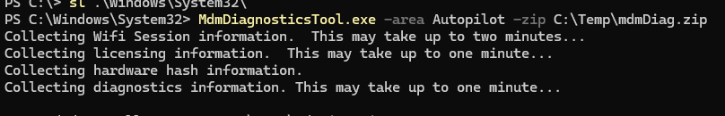
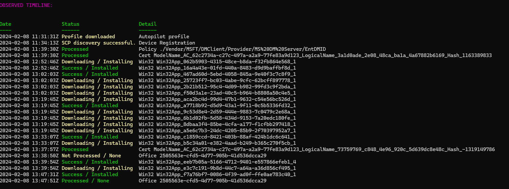

## Collecting Autopilot Diagnostic Logs

How to collect diagnostic logs from a device that is building currently or has been built.

1. Press `Shift + F10` or  `Fn + Shift + F10`, to open Command Prompt.
2. Type "PowerShell", to launch the PowerShell prompt.
3. Type , `New-Item -Path C:\ -Name Temp -ItemType Directory` to create the destination folder for the logs.
4. Type,`Set-ExecutionPolicy -ExecutionPolicy Unrestricted` to allow the script install later.
5. Make sure your location is, `"C:\Windows\System32`", if not type  `sl C:\Windows\System32\`.
6. Run, `MdmDiagnosticsTool.exe -area Autopilot -zip C:\Temp\mdmDiag.zip`.
7. Run, `Install-Script -Name Get-AutopilotDiagnostics -Scope CurrentUser`.
8. Run, `Get-AutopilotDiagnostics.ps1 -zip C:\Temp\mdmdiag.zip`.





## Autopilot Process stuck

How to check should your Autopilot build be stuck for long periods of time.

Firstly, check the Autopilot Diagnostic Logs first using [this section](#collecting-autopilot-diagnostic-logs).
If that gives you an application Id I would suggest using the section below for how to link that Id with the application.

## Finding an Application via it's Id

You'll need to grab the application ID using [this section](#collecting-autopilot-diagnostic-logs) first,
then substitute your app Id into the url below.

Include the `*`, where they are now.

`https://endpoint.microsoft.com/#blade/Microsoft_Intune_Apps/SettingsMenu/2/appId/**appid**`

> *Worth noting that this method is a bit hit and miss. The alternative is to connect via PowerShell to your tenant.*
> *and generate your own report to collect the application Ids.*

## Device is assigned to a user

You'll see this when you try to complete the user driven method when the username is pre-populated at the initial login prompt. During pre-provision, where it confirms the Autopilot profile, you'll see the user's email address underneath it.

Check out [this Microsoft doc for more information](https://learn.microsoft.com/en-us/autopilot/tutorial/user-driven/hybrid-azure-ad-join-assign-device-to-user#assign-autopilot-device-to-a-user-optional). Below is the condensed version.

1. Sign into the [Microsoft Intune admin center](https://go.microsoft.com/fwlink/?linkid=2109431).
2. Navigate to **Windows | Windows enrollment** screen, under **Windows Autopilot**, select **Devices**.
3. In the **Windows Autopilot devices** screen, locate the device to assign a user to.
4. Once the desired device is located, select the box to the left of the device, making sure that there's check mark in the box, and then select **Assign user** in the toolbar at the top of page.
5. Clear the user from here and click Save.
6. Reboot the device (maybe once or twice) and the user should no longer appear.

## Hardware Error during Pre-Provision

> More errors will be added as and when I find them.

### Autopilot securing your hardware 0x800705b4

[PowerShell script to troubleshoot TPM attestation issues](https://call4cloud.nl/2022/08/the-last-tpm-attestation-script-from-your-lover/)

> *`tpmtool getdeviceinformation` - Gets basic TPM information.*

#### Confirm Attestation Readiness

[Powershell Gallery Link](https://www.powershellgallery.com/packages/Autopilottestattestation/1.0.0.34)

1. Run Command Prompt as an admin.
2. Run the commands below.

```powershell
# Install the module
Install-Module -Name Autopilottestattestation -force
# Set the exetion policy
set-executionpolicy unrestricted
# Import the module
import-module -Name Autopilottestattestation
# Run the report
# Say yes to checking for updates.
test-autopilotattestation
```

Continue on below if you find errors or if you find no errors.

#### Reset the Device to Factory

> *Make sure to delete from MDM (not EntraID or Autopilot)*

Reset the device from the error page from Pre-provisioning, let this complete.

> *There is a command for PowerShell for a Windows 11 device, `systemreset --factoryreset`*

Try Pre-Provision again.

#### Clear the TPM Chip

> *There is always a small chance you could bork the machine doing this, don't do it without considering this.*

1. Open command prompt as an admin.
2. Type, `Clear-Tpm`.
3. Run the command, `tpmtool getdeviceinformation` command to ascertain TPM health, [Tool information](https://learn.microsoft.com/en-us/windows-server/administration/windows-commands/tpmtool).
4. Try the build again.

#### Escalate to Microsoft

You've tried everything so far to no end. Now to raise to Microsoft.
