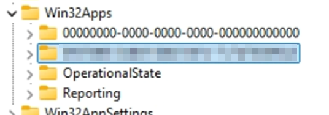
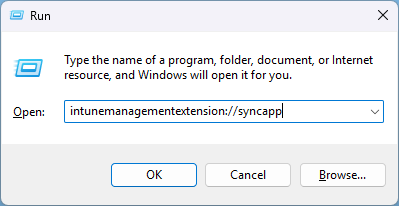

## Intro

I recently troubleshot inconsistent Win32 app installations for a client after the 24H2 update, which led to many machine rebuilds.
I investigated device check-in schedules, manually triggered app re-installs,
and reviewed Intune logs; so I’m sharing my findings to save others time.

Since covering everything at once would be too long, this will be the first in a multi-part post.

## Forcing a Re-Install

This seems like something that should be accessible in the Company Portal,
maybe behind an admin login. Manually digging through the Registry and deleting keys feels a bit archaic.

### Find your AppId

Firstly, you’ll need to go and find your application id from Intune.

1. Sign in to the [Microsoft Intune Admin Centre](https://intune.microsoft.com/).
2. Browse to **Apps > All Apps**.
3. Search for and Select your Application.
4. Click on the Application.
5. **Copy the App ID** from the address bar.


### Find and delete Registry keys

Next, locate any Registry keys related to this application on the device.

You can do this using the following command-line method:

1. Open PowerShell or a Terminal window as an administrator.  
2. Paste the following command, replacing `AppID Here` with your own App ID.  

> This may produce errors in PowerShell Core but runs without issues in older versions like 5.*.

```powershell
(gci -path HKLM:\SOFTWARE\Microsoft\IntuneManagementExtension\Win32Apps -Recurse | `
    ? Name -match "AppID Here").PSPath | % {
        Write-Host "Deleting key, $_ "
        Remove-Item -Path $_ -Recurse | out-null
     }
```

> Unfortunately, the command above isn't precise enough to find references within registry values,
> so you'll still need to check manually for any missed entries. I may update it later.

3. Type `Regedit` into the command line you opened previously.  
4. Navigate to `HKLM\SOFTWARE\Microsoft\IntuneManagementExtension\Win32Apps`.  


5. Under here, you will find keys that look like this:



+ 000000 represents the local device.
+ The highlighted entry corresponds to user-related apps, with a GUID unique to each user.

6. Paste in the application ID retrieved from Intune.  
7. Delete any key found during this process.  
8. Repeat the process until the search highlights the key or folder named **"App Authority"**.  
9. Run a sync from the device using one of the following options:  
    + Run, `Get-ScheduledTask -TaskName "Schedule #3 created by enrollment client" | Start-ScheduledTask`, in the powershell window.
    + Restart the IntuneManagementExtention service.
    + Open Run on the device, type `intunemanagementextension://syncapp`



> You can run a compliance sync using this comand, `intunemanagementextension://synccompliance`.

10. Now open Company Portal.
11. **Click on Apps and Downloads** and watch for the installer to run. You should see it appear in the downlads queue.

## Download is Stuck Pending

I hate seeing this, and in my experience, it happens more often with MSI files.  

Check `C:\Program Files (x86)\Microsoft Intune Management Extension\Content\Staging` for your download package—the folder name is the App ID.  

If needed, your application should 'unpack' here."

## Checking Intune Log for JobId

When a device requests something from Intune, it registers a job ID.
The command below helps find the job related to your app install.

Replace APPID HERE with your own appid.

```powershell
gc C:\ProgramData\Microsoft\IntuneManagementExtension\Logs\intuneManagement*.log | `
Select-String -Pattern "APPID HERE" | % {
    if ($_ -match '<!\[LOG\[(?<Message>.*?)\]LOG\]!><time="(?<Time>[\d:.]+)" date="(?<Date>\d{1,2}-\d{1,2}-\d{4})"(?<Misc>.*?)>') {
        [PSCustomObject]@{
            Date    = $matches.Date
            Time    = $matches.Time
            Message = $matches.Message.Trim()
            Misc    = $matches.Misc.Trim()
        }
    }
    else {
        [PSCustomObject]@{ RawLog = $_ }
    }
}
```

> You can add |Delayed within the same quotes as APPID HERE, like this: `Select-String -Pattern "APPID HERE|Delayed"`
> This may indicate if your request is being throttled. Requesting multiple syncs in a short time can trigger throttling.
> If the output is too large for your console window, pipe the command into Out-Gridview by adding the following after the last curly brace:
> ` | Out-Gridview`.

### Throttling Delay

I was surprised (not sure why!) to learn that application install requests can be throttled if you request syncs too frequently.

Use the script below to check if you're being throttled and the delay per request:

```powershell
gc C:\ProgramData\Microsoft\IntuneManagementExtension\Logs\intuneManagement*.log | `
Select-String -Pattern "Delay" | % {
    if ($_ -match '<!\[LOG\[(?<Message>.*?)\]LOG\]!><time="(?<Time>[\d:.]+)" date="(?<Date>\d{1,2}-\d{1,2}-\d{4})"(?<Misc>.*?)>') {
        [PSCustomObject]@{
            Date    = $matches.Date
            Time    = $matches.Time
            Message = $matches.Message.Trim()
            Misc    = $matches.Misc.Trim()
        }
    }
    else {
        [PSCustomObject]@{ RawLog = $_ }
    }
}
```

Next, I'll dive into checking installation applicability.

Hope this helps someone!
