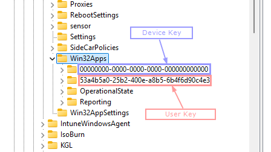
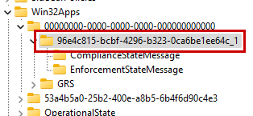

Figuring out whether an application is applicable from the Intune portal is pretty obvious. Knowing how to find
and check that information on a Windows device is a little less obvious.

## Registry Keys of note

Here are the key registry locations I check for policy and app installation details:

- `HKEY_LOCAL_MACHINE\SOFTWARE\Microsoft\PolicyManager`: Stores policy data, config profiles, and update policies.
- `HKEY_LOCAL_MACHINE\SOFTWARE\Microsoft\IntuneManagementExtension\Win32Apps`: Contains data on Win32 app deployments.
- `HKEY_LOCAL_MACHINE\SOFTWARE\Microsoft\IntuneManagementExtension\SideCarPolicies`: Stores data from the IntuneManagementExtension/EMS Agent.
- `HKEY_LOCAL_MACHINE\SOFTWARE\Microsoft\Windows\CurrentVersion\Uninstall`: Lists installed apps.

I’ll focus on Win32Apps.

## Win32Apps Registry key

The key *HKEY_LOCAL_MACHINE\SOFTWARE\Microsoft\IntuneManagementExtension\Win32Apps* stores data on all app deployments,
not just Win32 apps.

Use [this section (ctrl-click to open in a new tab)](http://localhost:1313/posts/february2025/intuneapptroubleshootingpost1/#find-your-appid)
in the previous post to locate your application IDs.

Under Win32Apps, you'll find:

- The `000000` key, which contains device-related data.
- SID-like keys for user-specific data.



In this case, I'm using the key `96e4c815-bcbf-4296-b323-0ca6be1ee64c`, which corresponds to the **Company Portal** app.



The AppId key has subkeys for Compliance State and/or Enforcement State. Clicking each displays information
(e.g., applicability, install context, and Intune’s desired app state) in JSON format.

```json
{
 "Applicability":0,
 "ComplianceState":1,
 "DesiredState":2,
 "ErrorCode":null,
 "TargetingMethod":0,
 "InstallContext":2,
 "TargetType":2,
 "ProductVersion":"11.2.1002.0",
 "AssignmentFilterIds":null
}
```

Using the subkeys to check on your deployments can come in very useful especially when something is not working as intended.

## Script Method

The script was originally created by **Ben Whitmore at Patch My PC**
(I highly recommend checking out PMPC for automatic patching for Intune). I modified it and added a few features.

Install the Microsoft Graph module to get both app names and IDs.
You'll only need the Authentication and Device Management modules.

<script src="https://gist.github.com/BassJamm/a72c6b944d8b738c1be19c8a8329ee82.js"></script>

Next Post is about the Intune Management Extension logs.

Hope this helps someone out!
