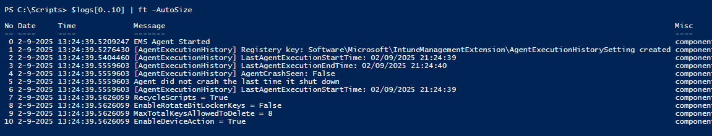

IME logs can be a nightmare to read, they're formatted terribly and sometimes are confusing as hell but,
they hold a wealth of information that can help diagnose issues and explain what your device is doing.

## Quick Summary on what the logs are

This log file remains the primary source for tracking IME activities, capturing most key events such as,
check-ins, policy requests, package management and much more. There are other log file that relate to other
components for example, the *Win32AppInventory.log* which collects information provided by
the *Win32AppInventory* Collector.

See this section [here](#parsing-the-log-to-make-it-more-readable) for my log parser and a console
command to search for strings.

## Useful Information in the logs

Quick list of things that are usefull to aid in troubleshooting:

`Delay`: This is a strong indication of throttling, which happens frequently.
The wait time is usually short enough to go unnoticed, but it's still worth checking—see the example below.

```text
13:24:41.1326004 set timer, delayed seconds = 19 for workload Win32AvailableApp
```

`APPId`: I’m referring specifically to the application ID from Intune for the app you want to install.
You can find instructions on how to retrieve it [here (Ctrl + Click to open in a new tab)](https://bassjamm.github.io/posts/feburary2025/intuneapptroubleshootingpost1/#find-your-appid),
and you should see a confirmation that your app has been added to the job, similar to the example below.  

```text
Add File to the Job, File Id: 501FCB7D-A970-4E34-A753-4B48FE5D8BEF_5b99406c
```

`policyid\name`, `ScriptNames`: Since they all have an entry in the IntuneManagementExtension log, you can verify them
being applied from the log files.

`Win32App`: This will display any entries related to the Win32App poller and its associated tasks. However,
be aware that these logs contain entries with carriage returns and newlines, which the parser struggles to
handle—I haven’t fixed this yet. Example logs:  

```text
2-15-2025 09:17:23.0191112 Starting Win32AppOnTimer task...                                                                                                                                                                       
2-15-2025 09:17:23.0208559 set timer, delayed seconds = 94 for workload Win32RequiredApp                                                                                                                                          
2-15-2025 09:17:23.0226018 set timer, delayed seconds = 59 for workload Win32AvailableApp                                                                                                                                         
2-15-2025 09:18:16.1279987 [Win32App] Checking ESP status and phase for sessionId: 0                                                                                                                                              
2-15-2025 09:18:16.2447354 [Win32App] CheckDeviceOnlyFromFirstSyncReg Opening SOFTWARE\Microsoft\Enrollments
```

## Making the logs more readable

You've got 2 good options that I have used:

- *CMTrace*: the one and only, this makes things much easier but, now SCCM is no longer supported,
not as easy to get hold of.
- I put together a script to make the logs more readable, but be aware that it can’t parse every entry just yet.
It struggles with log entries containing carriage returns or newlines, though this isn’t a major issue since those are relatively rare.

### Download CMTrace

1. Go to the [Evaluation Center](https://www.microsoft.com/en-us/evalcenter/download-microsoft-endpoint-configuration-manager).  
2. Under *Exe download*, click the version number to start downloading the ConfigMgr suite, which includes CMTrace.  
3. Run or extract the downloaded `.exe` file.  
4. Open the extracted folder.  
5. Navigate to `cd.retail.LN\SMSSETUP\TOOLS`.  
6. Copy the `.exe` file to a location of your choice for easy access.

### Useful Scripts

> Both scripts can be used to parse any of the Intune Logs on the Device.

#### Parsing the log to make it more readable

The script uses a regex pattern to try to convert the text log into varibles that PowerShell can use in someway.
It turns the logs from the below:

```text
<![LOG[The sideCar gateway url from OnStart is : https://agents.amsub0502.manage.microsoft.com/TrafficGateway/TrafficRoutingService/SideCar/StatelessSideCarGatewayService]LOG]!><time="13:24:40.3649407" date="2-9-2025" component="IntuneManagementExtension" context="" type="1" thread="4" file="">
<![LOG[Found 1 MDM certificates from Local Computer Store.]LOG]!><time="13:24:40.3649407" date="2-9-2025" component="IntuneManagementExtension" context="" type="1" thread="4" file="">
<![LOG[[Telemetry] Telemetry is enabled. Starting mananger...]LOG]!><time="13:24:40.3790864" date="2-9-2025" component="IntuneManagementExtension" context="" type="1" thread="4" file="">
<![LOG[[Telemetry] Telemetry metadata registry values initialized.]LOG]!><time="13:24:40.3808236" date="2-9-2025" component="IntuneManagementExtension" context="" type="1" thread="4" file="">
<![LOG[Start watching registry SOFTWARE\MICROSOFT\IntuneWindowsAgent\Logging]LOG]!><time="13:24:40.3818279" date="2-9-2025" component="IntuneManagementExtension" context="" type="1" thread="4" file="">
<![LOG[Found 1 MDM certificates from Local Computer Store.]LOG]!><time="13:24:40.3818279" date="2-9-2025" component="IntuneManagementExtension" context="" type="1" thread="4" file="">
```

Into this:



<script src="https://gist.github.com/BassJamm/0b346ebb45ef0df45af926ae5dcdbabd.js"></script>

#### Searching for strings in the logs quickly

This console command can be used to search for strings in the logs and still make them more readable. Amend the
pattern on line 2 where it says "CHANGE STRING HERE".

<script src="https://gist.github.com/BassJamm/e5c643f9c26691804075e40732315e26.js"></script>

Hope this hels someone out!
