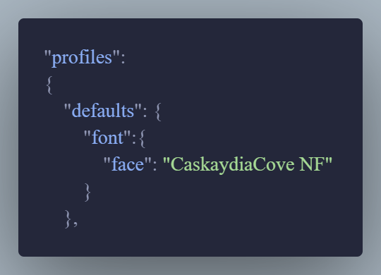
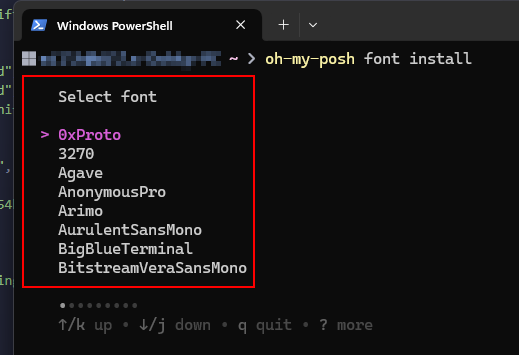

OH MY POSH is a powerful tool for customizing your terminal prompt, adding vibrant themes and useful context to enhance productivity. With easy installation, you can create a personalized and visually appealing terminal in minutes.

## TL;DR

> *Theme list from [OH MY POSH](https://ohmyposh.dev/docs/themes).*

1. Install OH MY POSH, `winget install JanDeDobbeleer.OhMyPosh -s winget`.
2. Install a Font, `oh-my-posh font install`.
3. Edit your PowerShell config to the new font, [see here for this step](Add link).
4. Edit your PowerShell profile using Notepad, `notepad $PROFILE`.
5. Add the following example line and click save, `oh-my-posh init pwsh --config "$env:POSH_THEMES_PATH\easy-term.omp.json" | Invoke-Expression`. Change the theme name to whichever you chose.

## Steps

> *Installation steps for Windows from [OH MY POSH website](https://ohmyposh.dev/docs/installation/windows).*

1. Open a PowerShell prompt as your own user (if you use your prompt as an admin, then do this as an admin).
2. Install OH MY POSH, `winget install JanDeDobbeleer.OhMyPosh -s winget`.
3. Close and re-open your prompt or, if using the Terminal app, just add a new tab.
4. Install a font, type, `oh-my-posh font install` and select a font from the list, use the arrow keys to navigate and Enter to confirm the selection. I use *CaskaydiaCode*.
   + 
5. Now to edit your PowerShell profile to load the OhMyPosh config on run. Use this command, `notepad $PROFILE` and it should open a notepad file that is blank.
   + 
6. Add the following line and click save,`oh-my-posh init pwsh --config "$env:POSH_THEMES_PATH\easy-term.omp.json" | Invoke-Expression`.
7. Close and re-open your prompt again to see the changes.

> *Theme list from [OH MY POSH](https://ohmyposh.dev/docs/themes).*

## My current PowerShell Profile

+ `Set-PSReadLineOption -PredictionViewStyle listview`, sets the modules prediction view style to a list, which is much easier to use. Install it with `Install-Module PSReadLine`.
+ Secondly, I set the location to the home directoy, this makes my life easier for where I store my Git repos.
+ Thirdly, I add a short hand alias to notepad++.
+ Lastly, is the OH MY POSH config.

> Be mindful that the more added in the profile, the longer opening the prompt will take.

## Issues you may come across

### Installed fonts disappearing after restart on Windows 11

> Credit for this fix is at [this Microsoft forum post](https://answers.microsoft.com/en-us/windows/forum/all/solution-installed-fonts-disappearing-after/146f4039-47c3-4017-a9b1-76f72badce39).

Install your fonts for all users, using administrator access.

1. Press **Windows Key + R** to open the Run dialog.
2. Paste `%localAppData%\Microsoft\Windows\Fonts` and press Enter.
3. You should see all your installed fonts, press `Ctrl + A` to select all the font files.
4. Right click any one of the files and press "**Install for all users**" (with the shield icon, requires administrator privileges).

Hope this helps someone!
