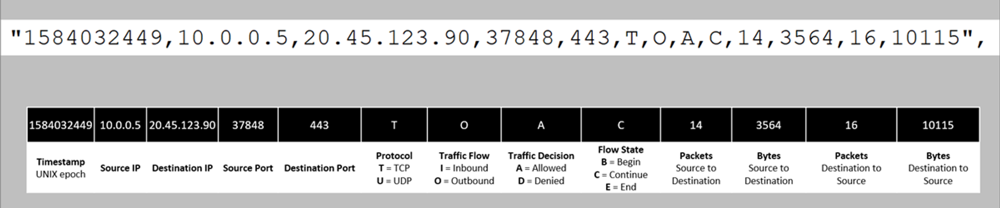

Azure Network Security Groups (NSGs) are essential tools for managing and securing network traffic in Azure. Acting as virtual firewalls, NSGs allow you to define rules that control inbound and outbound traffic to resources. They are commonly used to protect virtual machines, enforce network segmentation, and ensure secure access within virtual networks.

> *Most of the information below has been taken from Microsoft articles. I won't pretend I came up with all this, just condensed it a bit.*

## Rules and Priorities

### Service Tags  

[Learn more about Virtual Network Service Tags | Microsoft Docs](https://learn.microsoft.com/en-us/azure/virtual-network/service-tags-overview)  

Service tags simplify network security by grouping IP address prefixes for specific Azure services. These tags are managed and automatically updated by Microsoft, eliminating the need for frequent manual updates when service addresses change.  

For example, using a service tag like `Storage` in your network security rules ensures you allow all necessary traffic for Azure Storage without tracking individual IP addresses. This approach reduces complexity and keeps your configurations up-to-date effortlessly.

### Rule Priority  

Rules in Azure Network Security Groups (NSGs) are assigned a priority value between 100 and 4096. Lower numbers indicate higher priority, meaning rules with lower numbers are processed first.  

Once traffic matches a rule, further processing stops. This means any rules with lower priority (higher numbers) that overlap with higher-priority rules will not be processed. Plan accordingly.

### Some Rule Suggestions

Check out the list of suggested rules I have put together, they may not be good for all situations but, give an idea of where to start.

[Link to the Github Gist](https://gist.github.com/BassJamm/2741bf13d007d98fd08eb058613a1eea)

> *This would not embed properly in the website, I assume because it is a markdown file.*

## Flow Logs

NSG flow logs is a feature of Azure Network Watcher that allows you to log information about IP traffic flowing through a network security group (NSG). Flow data is sent to Azure Storage from where you can access it and export it to any visualization tool.

[Flow logs for network security groups | Microsoft doc link](https://learn.microsoft.com/en-us/azure/network-watcher/network-watcher-nsg-flow-logging-overview)

### Common use cases

> *All of the below information has been ripped out of a Microsoft doc, not my original material.*

#### Network monitoring

- Identify unknown or undesired traffic.
- Monitor traffic levels and bandwidth consumption.
- Filter flow logs by IP and port to understand application behavior.
- Export flow logs to analytics and visualization tools of your choice to set up monitoring dashboards.

#### Usage monitoring and optimization

- Identify top talkers in your network.
- Combine with GeoIP data to identify cross-region traffic.
- Understand traffic growth for capacity forecasting.
- Use data to remove overly restrictive traffic rules.

#### Compliance

- Use flow data to verify network isolation and compliance with enterprise access rules.
- Network forensics and security analysis
- Analyze network flows from compromised IPs and network interfaces.
- Export flow logs to any SIEM or IDS tool of your choice.

### Reading the flow log

- Logs are in JSON format and will be outputting in the json file format.
- The information that is interesting is in the flowtuples section of the json file.

### Example flow log entry

```json showLineNumbers
{
    "records": [
        {
            "time": "2018-11-13T12:00:35.3899262Z",
            "systemId": "a0fca5ce-022c-47b1-9735-89943b42f2fa",
            "category": "NetworkSecurityGroupFlowEvent",
            "resourceId": "/SUBSCRIPTIONS/00000000-0000-0000-0000-000000000000/RESOURCEGROUPS/FABRIKAMRG/PROVIDERS/MICROSOFT.NETWORK/NETWORKSECURITYGROUPS/FABRIAKMVM1-NSG",
            "operationName": "NetworkSecurityGroupFlowEvents",
            "properties": {
                "Version": 2,
                "flows": [
                    {
                        "rule": "DefaultRule_DenyAllInBound",
                        "flows": [
                            {
                                "mac": "000D3AF87856",
                                "flowTuples": [
                                    "1542110402,94.102.49.190,10.5.16.4,28746,443,U,I,D,B,,,,",
                                    "1542110424,176.119.4.10,10.5.16.4,56509,59336,T,I,D,B,,,,",
                                    "1542110432,167.99.86.8,10.5.16.4,48495,8088,T,I,D,B,,,,"
                                ]
                            }
                        ]
                    },
                    {
                        "rule": "DefaultRule_AllowInternetOutBound",
                        "flows": [
                            {
                                "mac": "000D3AF87856",
                                "flowTuples": [
                                    "1542110377,10.5.16.4,13.67.143.118,59831,443,T,O,A,B,,,,",
                                    "1542110379,10.5.16.4,13.67.143.117,59932,443,T,O,A,E,1,66,1,66",
                                    "1542110379,10.5.16.4,13.67.143.115,44931,443,T,O,A,C,30,16978,24,14008",
                                    "1542110406,10.5.16.4,40.71.12.225,59929,443,T,O,A,E,15,8489,12,7054"
                                ]
                            }
                        ]
                    }
                ]
            }
        },
        {
            "time": "2018-11-13T12:01:35.3918317Z",
            "systemId": "a0fca5ce-022c-47b1-9735-89943b42f2fa",
            "category": "NetworkSecurityGroupFlowEvent",
            "resourceId": "/SUBSCRIPTIONS/00000000-0000-0000-0000-000000000000/RESOURCEGROUPS/FABRIKAMRG/PROVIDERS/MICROSOFT.NETWORK/NETWORKSECURITYGROUPS/FABRIAKMVM1-NSG",
            "operationName": "NetworkSecurityGroupFlowEvents",
            "properties": {
                "Version": 2,
                "flows": [
                    {
                        "rule": "DefaultRule_DenyAllInBound",
                        "flows": [
                            {
                                "mac": "000D3AF87856",
                                "flowTuples": [
                                    "1542110437,125.64.94.197,10.5.16.4,59752,18264,T,I,D,B,,,,",
                                    "1542110475,80.211.72.221,10.5.16.4,37433,8088,T,I,D,B,,,,",
                                    "1542110487,46.101.199.124,10.5.16.4,60577,8088,T,I,D,B,,,,",
                                    "1542110490,176.119.4.30,10.5.16.4,57067,52801,T,I,D,B,,,,"
                                ]
                            }
                        ]
                    }
                ]
            }
        }
```

### Flow Tuples

flowTuples: String that contains multiple properties for the flow tuple in a comma-separated format

Example entry: 1493695838,185.170.185.105,10.2.0.4,35370,23,T,I,A,C,1021,588096,8005,4610880



## Script to read the logs via PowerShell

Dump the below into a file as a script (.ps1) filetype.

To use the script below, navigate to the location of the file, and use the NsgFlowLogFileName switch to select the JSON file. Then run the command `.\Parse-NSG-FlowLog_json.ps1 -NsgFlowLogFileName .\PT1H.json | ft -AutoSize`

<script src="https://gist.github.com/BassJamm/8b2c681b0dbd463e2f8f630fed391586.js"></script>

Hope this helps someone!
